## 准备

### 安装 Git，[下载网址](https://git-scm.com/download/)

### 下载仓库

> 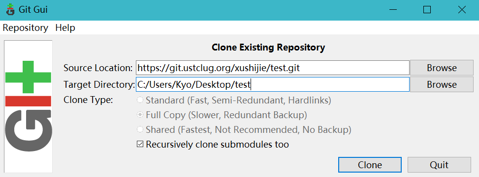

## 配置Git GUI
### 配置用户名和邮箱

邮箱可以随便填，必要但不重要

> $ git config --global user.name '许仕杰'
>
> $ git config --global user.email 'xushijie95@outlook.com'
>
> 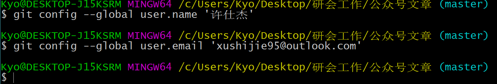

### 配置服务器地址

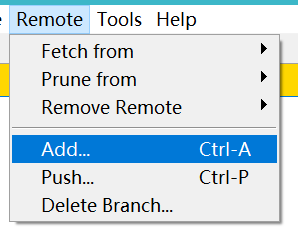

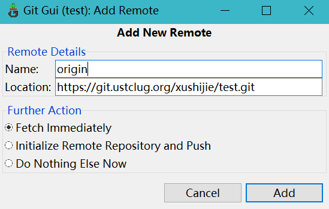

## 使用

### 同步本地和服务器

> 首先 **fetch**，从服务器上取得最新的版本
>
> 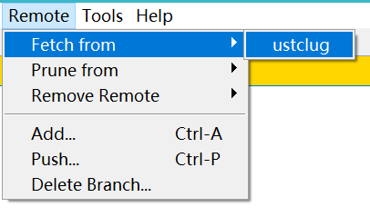
> 接下来 **merge**，合并到本地
>
> 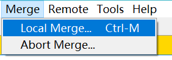

### 提交修改

> 1. 扫描，git会根据.gitignore文件定义的规则扫描所有文件及子文件
>
> 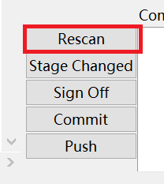
>
> 2. 发现改变并点击 **stage changed**按钮
>
> 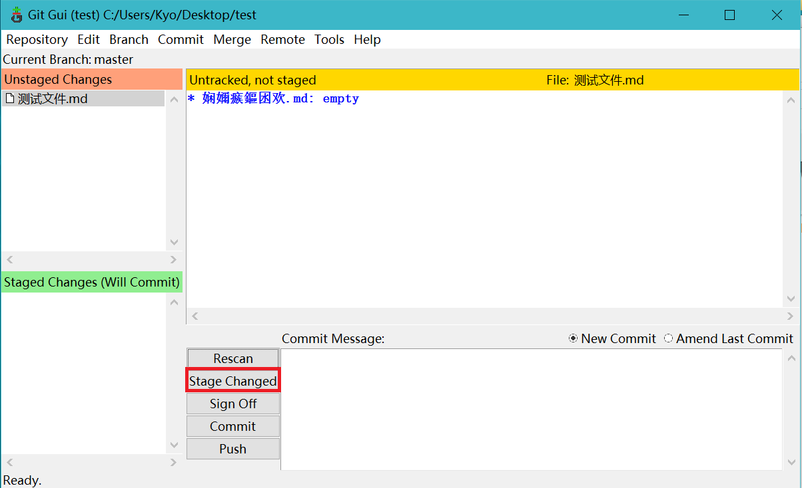
>
> 3. 提交，需要写一条提交的理由，比如自己做了哪些事情
>
> 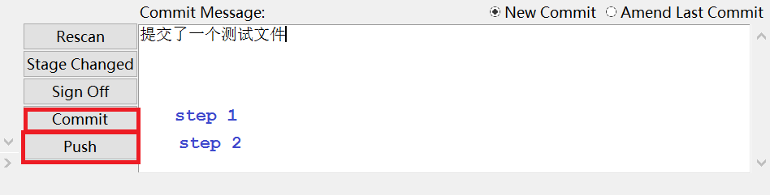
> 4. 点击 **push**按钮，push到服务器上，让所有人都能看到
>
> 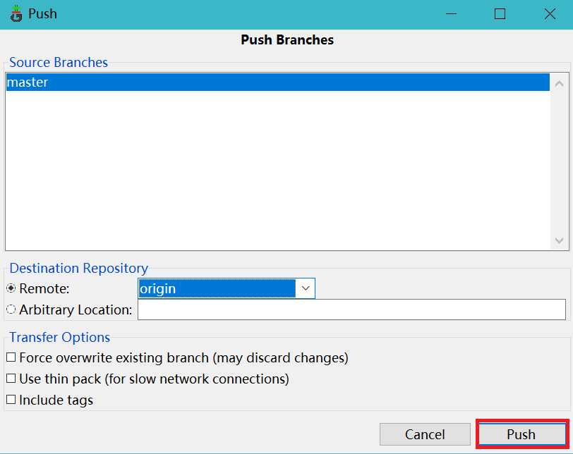
> push成功后如下
>
> 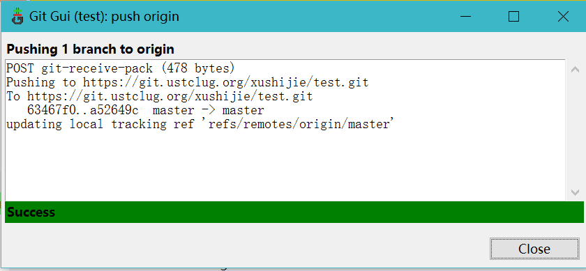
> ps: 如果 push失败了，可能需要先从服务器上下载最新版本，再 push