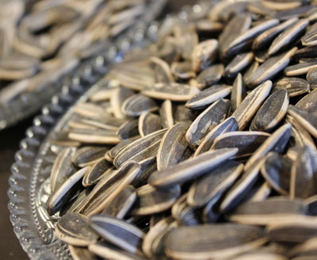
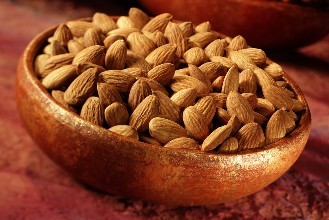
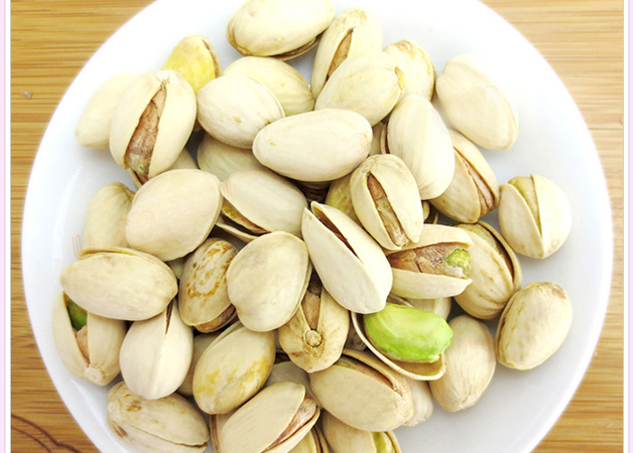
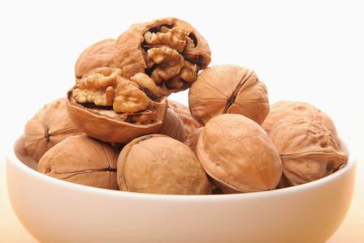
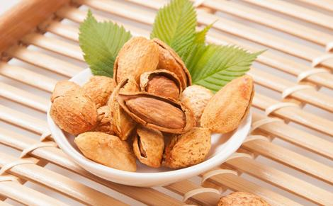
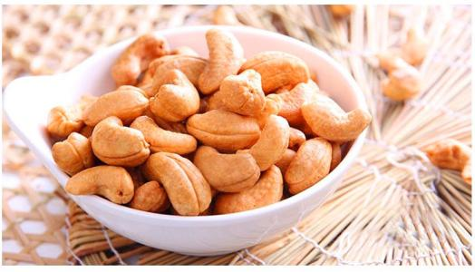
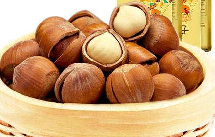
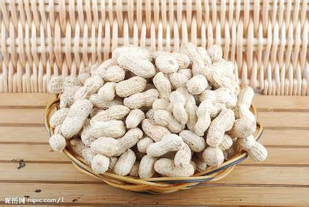

### 瓜子

又叫瓜子儿、边果，种类有葵花子、西瓜子、南瓜子等，富含维生素、蛋白质、油类。

安定情绪、防止老化、增强记忆力；盐分太高，容易引发高血压。

卡路里：606大卡/100g,  每100克瓜子的热量约占中国营养学会推荐的普通成年人保持健康每天所需摄入总热量的26%。

### 杏仁

分甜、苦两种，杏的种子。富含蛋白质、脂肪、糖、微量苦杏仁苷。

控制胆固醇、降低心脏病发病危险；未经处理的杏仁有毒。

卡路里：562大卡/100g

### 开心果

又名必思答、绿仁果、阿月浑子等。富含维生素、矿物质、抗氧化元素。

低脂肪、高纤维。

卡路里：614大卡/100g

### 核桃

核桃，又称胡桃，羌桃。富含蛋白质、脂肪、微量元素。

ps：核桃健脑的说法并不准确。

核桃性热，多食生痰动火；不能与鸡鸭肉同食，影响消化。

卡路里：627大卡/100g

### 碧根果

.jpg)

碧根果是美国山核桃的果实，又名长寿果。富含蛋白质、不饱和脂肪酸。

补肾健脑、补中益气，润肌肤、乌须发。

卡路里：670大卡/100g

### 巴旦木

又称美国大杏仁，是扁桃的核。富含植物油、蛋白质、微量元素。

抗衰老、有益心脏健康、血糖平衡。

卡路里：586大卡/100g

### 腰果 

腰果又名槚如树、鸡腰果、介寿果。营养价值较高，富含微量元素。

经常食用能强身健体、提高免疫力。

ps：种子和果皮与有毒。

卡路里：552大卡/100g

### 榛子

榛子，又名山板栗、尖栗或棰子。富含脂肪、蛋白质。

虽然脂肪含量高，却可以降血压血脂，还含有抗癌化学成分紫杉醇。

卡路里：542大卡/100g

### 花生

又名落花生。富含蛋白质、脂肪、微量元素、维生素。

抗衰老、增强记忆，降低胆固醇。

卡路里：298大卡/100g

