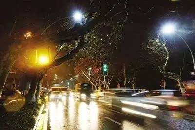
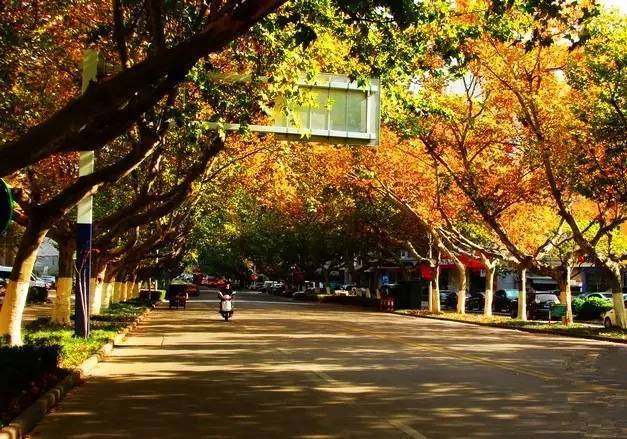

### 【封面图片】

### 【文章标题】
赵雷的《成都》火了成都，这首关于合肥的英文歌曲也突然火了……
### 【文章正文】

最近几天，一首名为《芜湖路》的英文歌曲走红朋友圈，

“爱情故事每天都在这里发生，

像阳光总是照耀，

沿着芜湖路走，

叶子依然落下……”

芜湖路，是合肥最美的道路之一。路的两边，高大的法国梧桐横柯交映， 织成一条翠绿的拱廊。

这首歌的创作者，是一位20岁的合肥小伙刘天阳，目前就读于安徽医科大学，土生土长的合肥人。

听过这首充满生活气息的民谣后，内心升起了满满的感动。很多网友表示，这首歌是合肥版的《成都》。

在上周末《我是歌手》舞台上，《成都》这首民谣，伴随着赵雷那颗粒质感的嗓音，直透人心，唤起了多少观众的家乡情怀。

每个人的心中都有一个“成都”，《芜湖路》可能就是合肥人心中的那个“成都”吧。

***

有人说，芜湖路是合肥的香榭丽舍大街，在节奏越来越快的现代都市，慢节奏的街区生活再难找到。就像歌中唱的，在芜湖路旁，只有树叶依旧落下。

(*这是1987年的芜湖路*)

（*这是2017年的芜湖路*）

如今，芜湖路正在进行精品街区改造，不久之后，全合肥最精致的一条街道将在我们身边出现。这条合肥最美的路，在时间的侵蚀下，终将变得面目全非。

沧海桑田，斗转星移，时间能改变一切，却唯独改变不了我们心中的那一缕情怀。

无论多少年过去，回忆起心中的“芜湖路”，你是否想到了这样的画面：儿时与同伴在校园里嬉戏，骑着单车在树荫下飞奔，还有清晨打完球后头发上的水珠？

一条路也许很短，但是却足以承载我们一生的情感。

（*秋天的芜湖路*）

从《黍离》到《麦秀》，从许嵩的《七号公园》到刘天阳的《芜湖路》，从两千年前的诗经时代到现在，我们一直在歌唱，歌唱那些最质朴的情感。

荡气回肠也好，缠绵悱恻也好，平淡如水也好，都值得回忆。

也许，我们都该去芜湖路走一走。

***

图文 *夏簟清兮* 图片来自网络