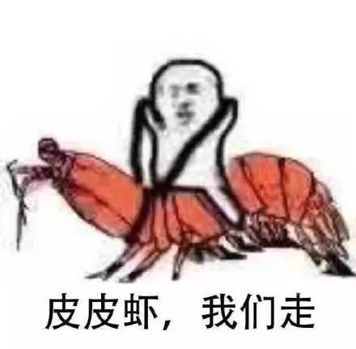

### 【封面图片】

### 【文章标题】

追完诗词大会，来邂逅一场元宵灯谜吧！

### 【文章正文】

春节还没过几天，宝宝又要回到学校了。

越来越淡的年味，更是让人们还没过完元宵就早早进入了工作状态。而元宵似乎也是一个可有可无的节日。

“去年元夜时，花市灯如昼。
月上柳梢头，人约黄昏后。”

这是古人的元宵节，在这一天家家户户张灯结彩，不分男女一同上街赏灯玩乐。

是不是很羡慕？

古人的元宵，一项重要的活动就是猜灯谜。

谜语，据说早在夏朝就已经出现，到了宋代，有文人把写着谜语的字条贴在纱灯上，吸引过往的行人，遂有“灯谜”之称。后来灯谜在民间流行起来，蔚然成风。

据说东汉的蔡邕出过一个谜语：

“黄绢幼妇外孙齑臼”

这个谜语的难度，让曹操都猜不出来，还是才子杨修猜出来了。你能猜出吗？

说了这么多，你是不是准备大展身手呢？别急，不妨看看下面的攻略。

【灯谜攻略】

先来一个简单的热热身：

“个儿小又圆，

性情柔又软，

皮肤白又嫩，

心里香又甜。”

谜底是什么？

聪明的你一定能很快想到答案，没错——元宵。

其实灯谜再复杂，也有套路可循，简单列举几种方法：

【半面法】

例：柴扉半掩，谜底：棑

特点：将谜面汉字各撷取一半，而后拼成谜底。

【方位法】

例：孔雀东南飞，谜底：孙

特点：根据谜面指示的东南西北、上下左右等方位，将有关字或偏旁部首进行组合，得到谜底。

【会意法】

特点：根据字义分析，是猜制灯谜的常用手段。例如前面举的元宵的例子。

还有更多的猜灯谜方法，就要靠聪明的你发动脑筋去挖掘啦~

小编也为大家准备了一些灯谜，大家快快戳进，发挥聪明才智，看看能做对几道？

(跳转链接)

***

图文 *夏簟清兮* 图片来自网络