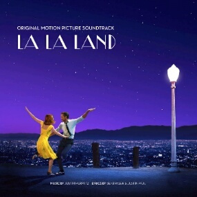
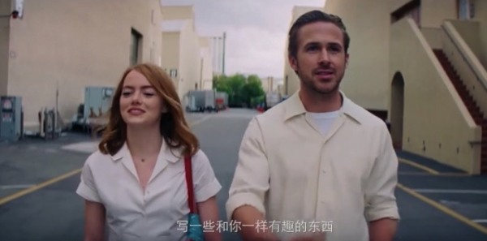
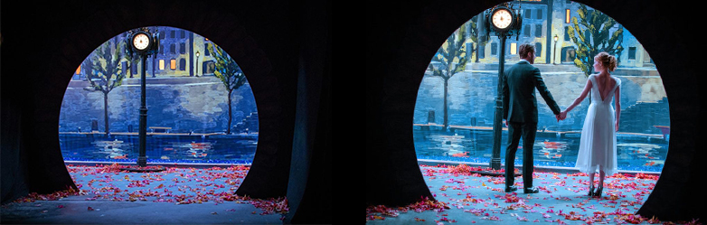

### 【封面图片】

### 【文章标题】

致所有有梦想的人 

### 【文章正文】

致所有有梦想的人，虽然他们很愚笨；致所有有梦想的傻子，虽然他们很疯癫。

***

”City of stars,

（繁星之城）

are you shining just for me?

（你是否只为我而闪耀？）

City of stars,

（繁星之城）

there's so much that I can't see.

（世间有太多不可明了）

Who knows,

（谁又能明了）

is this the start of something wonderful and new,

（这究竟是一切美好即将降临的某个预兆）

or one more dream that I cannot make true?

（还是又一个终将成空的黄粱梦晓？）

在纸醉金迷，物欲横流的洛杉矶，两个有梦想的年轻人。

一个是在咖啡厅打工的平凡女孩；一个是在餐厅弹着老掉牙曲目的男孩

一个不甘心命运，每天不停试镜；一个不甘心埋没才华，想要复兴爵士乐

一个天生丽质；一个英俊潇洒
.jpg)

.jpg)

女主的歌声生动地展示了她的内心：

“We're in the fast lane

（我们正在通往梦想的大道上）

Someone in the crowd could be the one you need to know

（人潮中的过客，也许就是生命中的贵人）

The one to finally lift you off the ground

（助我放飞梦想）

Someone in the crowd could take you where you want to go

（人潮中的过客，也许能展开我新的篇章）

……”

***

他们不期而遇，彼此嘲讽；命运却将他们紧紧纠缠在一起，最终，他们相爱了。

“我记得你，你叫什么名字？”

”好奇怪，我们总是碰见对方。”

一切就是这么的巧合，世界上有那么多餐馆，你却偏偏走进了我在的这一家。

冬去春来，时光荏苒。

那个大雪纷飞的**春天**，女主正在和前男友的家人聚餐，

突然，从心底升起一股乐章，引导着她走出室内，来到公路上，又狂奔起来……

这是她告别过去的时刻，从此她成为了勇敢追求梦想的人，而不再是一只金丝雀。

是梦想的力量，将两个几乎一无所有的年轻人连接起来。

他们一起歌唱，一起舞蹈，度过了最浪漫的一段时光。

***

春宵苦短日高起，梦也终究会醒。

男主最终屈服于世俗，加入了乐队，成为了键盘手，努力养家糊口。

正当男主觉得自己的事业有了起色之时，

女主的心境却糟糕到了极点。

两人因为见面的时间越来越少而逐渐疏远，当初各自追逐的梦想也被岁月磨平了棱角。

当女主质问男主为什么事情会变成这个样子？

我们知道，是那个电话，在二人之间，划出了一道沟壑。

渐行渐远渐无书，河汉迢迢难再渡。

“我真正爱的，是那个为梦想不屈不挠的你啊。”

没有了梦想，男神也会变成凡人。

所幸的是，他们还爱着彼此。

最终，在给女主最后的鼓励后，他们彻底地分道扬镳了。

“如果你得到这个机会，你就要全力以赴。”

“那我们怎么办？”

“我想我们只能等着看结果了。”

这大概是我听过的最美好的分手感言了。

也许，我们从未爱过彼此？

***

多年之后，女主成为了炽手可热的明星，无意间走进了一家小有名气的爵士餐厅，

挂着"Sebs"的牌子，那舞台上坐着的，除了你还能是谁呢？

再一次走进了你的餐厅，千言万语，却只能化为记忆。

只有在梦里，我们终成眷属。

***

这是成年人的爱情片，也是一部励志片。

“无论多么愚蠢，致那些受挫的心；无论看起来多么愚钝，致那些有梦想的人。”

致他们，也致我们大家。

***

图文 *夏簟清兮* 部分图片来自网络