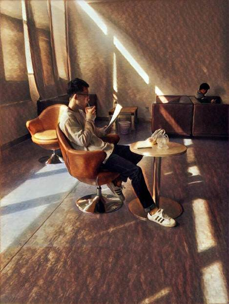
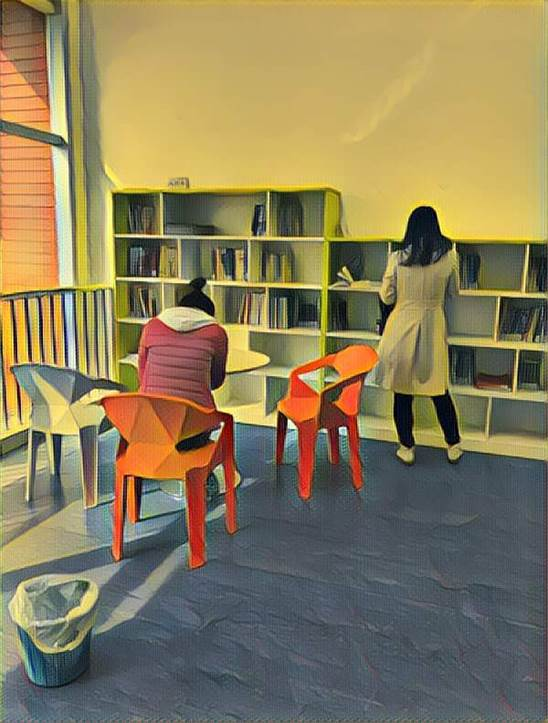
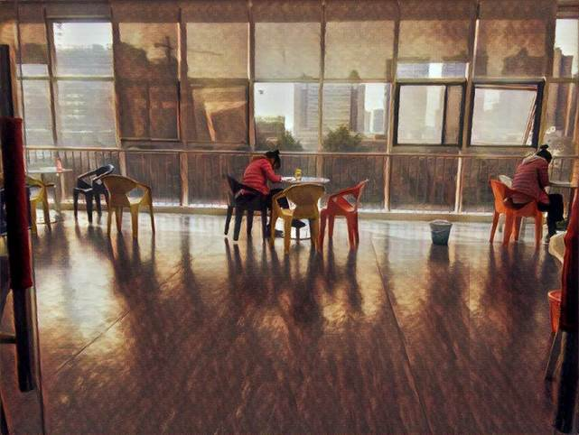
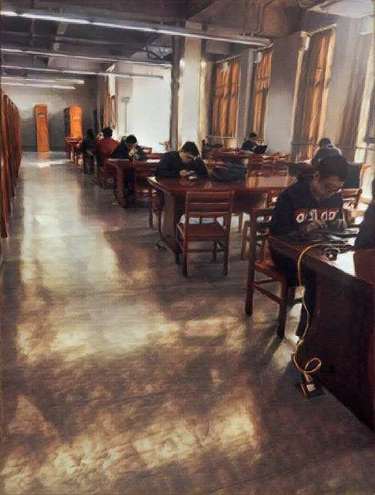
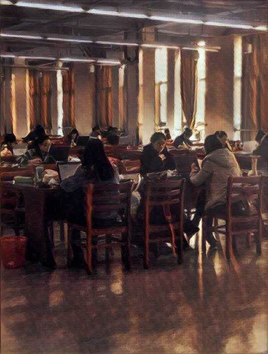
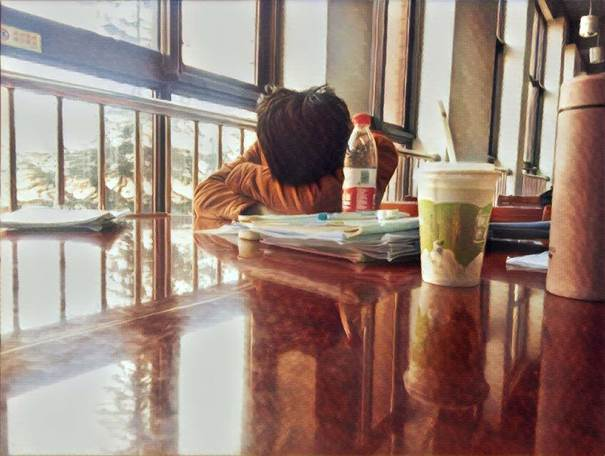
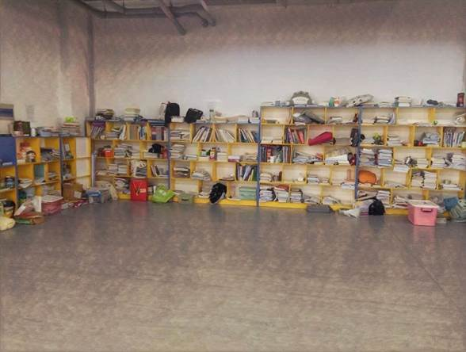
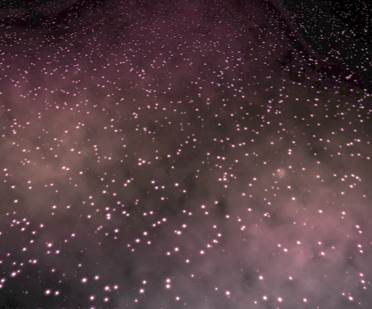

【封面图片】

(*FILLL IN HERE*)

【文章标题】

图书馆出现神秘信号，原因竟然是……

【文章正文】

这天中午，小编在图书馆自习到一半，突然觉得直犯困，想吹股WIFI之风解解闷，拿出手机搜索WIFI，却不料发现了一个神秘的WIFI信号：

这位“帅到正无穷”同学是何方神圣？如此高调又究竟所图为何？

小编也很好奇，于是便将此事暗暗记在了心上。这天一大早，趁着有空带上相机，开始在东区图书馆里寻找起来。

在此过程中，小编也领略了科大学子们追求知识，顽强的拼搏的心态，以及科大浓郁的学术氛围，不禁对他们肃然起敬……

***

七点一刻，新鲜的早餐加一篇文献，嗯，满满的营养

“吾日必三省吾身：昨天的文献还记得吗？今天要看什么？这周的组会说什么？”

三更灯火五更鸡，正是男儿读书时

青春的花朵只有被汗水浇灌过，才能盛开得愈发艳丽

书读百遍，其义自见

茫茫书海里的轻鸿一瞥，串起了时空两端遥远的灵魂。

谁是谁命中的过客，谁是谁生命的轮回。

谁说智慧和美貌不能并重？我们看过的书，爱过的人，走过的路，随着时间的积淀，都会像芬芳馥郁的花朵一样，自然流露出来，那些是最美的年华

晨钟暮鼓催人急，燕去雁来促我忙

《庄子》云：“吾生也有涯,而知也无涯”，

在学问的海洋里，我们都是一叶孤舟，只有勤恳的劳动，才能到达胜利的彼岸

迎着清晨的第一缕阳光，挥毫洒墨，信笔游龙~

你走进座位，及腰马尾，轻启书卷，笑容总让人如沐春风~

一张张书桌安静地陪伴着蜗壳学子的每一天奋笔疾书

有那么一小会儿，浓浓倦意袭来，你不舍地放下书本，小憩片刻

书香满柜，满屋静谧

书卷多情似故人，晨昏忧乐每相亲。多去图书馆坐坐吧，多去书海泛舟，相信，你的每一种感触都能找到共鸣，每一个困惑都会得到答案。一个人只有今生今世是不够的，他还应当有诗意的世界，书籍，给了我们诗意的启蒙，懵懂的初心。相信，一本书是一颗星星，多摘一些星星，一个人的夜路会更亮一些。如果我自己是那么美好，那么一切恐惧就可以烟消云散。

当你捧起书，体味武侠的铁血丹心，揣摩作家的匠心独具，沉浸学术的策无遗算，得其法而挥之一笑，快哉~

路漫漫其修远兮，吾将上下而求索

***

图文 王亚倩